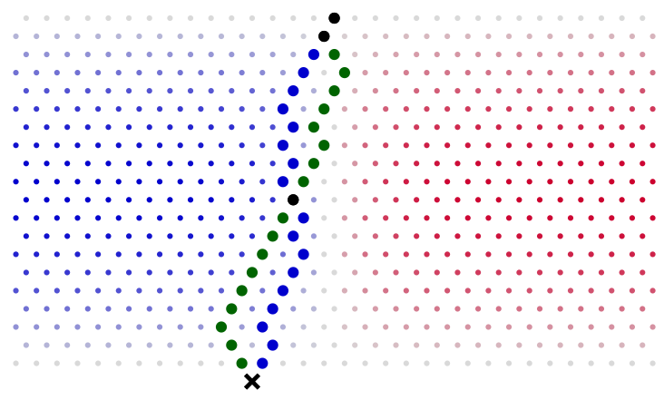
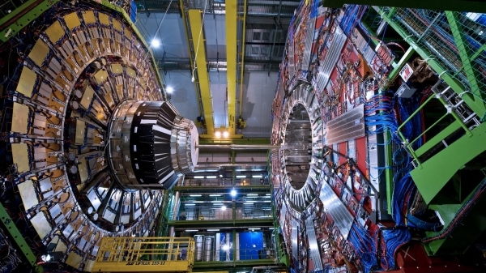
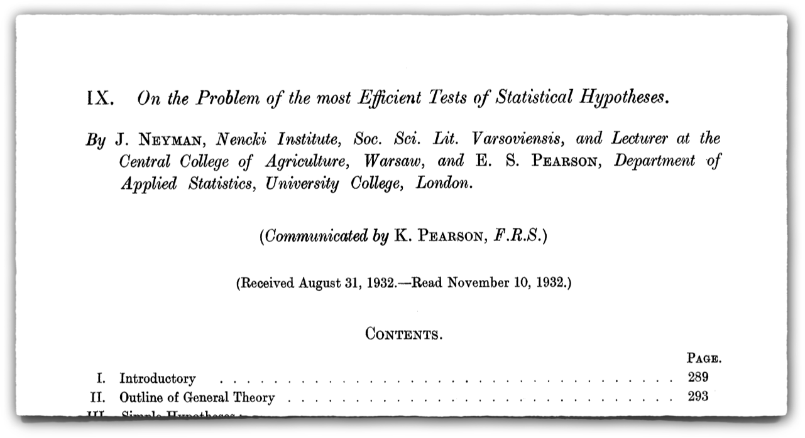
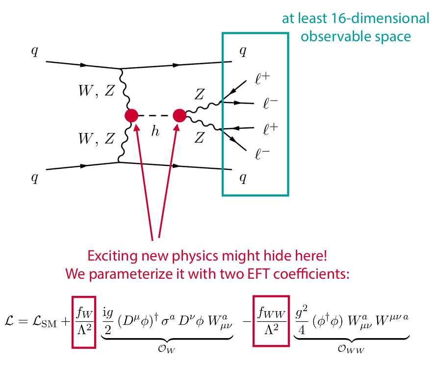
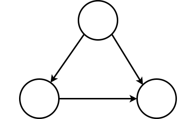
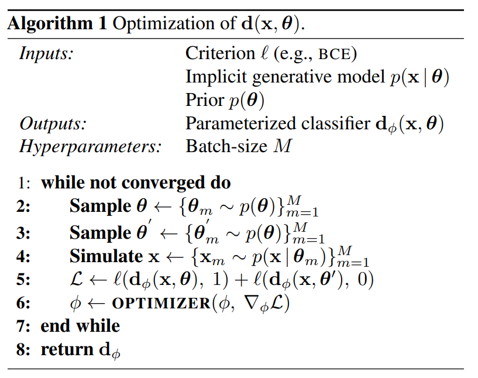
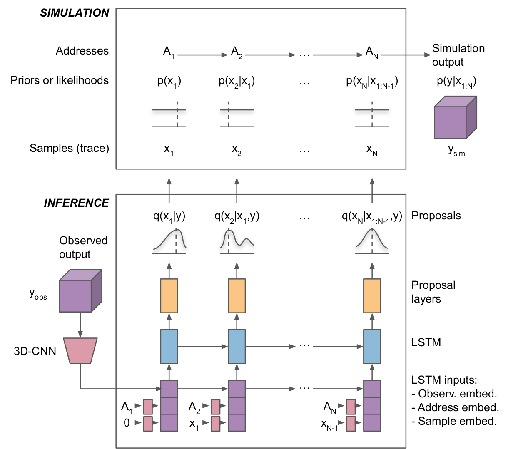

class: middle, center, title-slide
count: false

# Neural Likelihood-free Inference

PhD AI seminars<br>
October 21, BeCentral, Brussels

<br><br>

Gilles Louppe<br>
[g.louppe@uliege.be](mailto:g.louppe@uliege.be)

---

class: middle, black-slide

.center[<video controls autoplay loop muted preload="auto" height="480" width="640">
  <source src="./figures/galton.mp4" type="video/mp4">
</video>]

---

<br>
.center.width-70[]

The probability of ending in bin $x$ corresponds to the total probability of all the paths $z$ from start to $x$,
$$\begin{aligned}
p(x | \theta)
= \int p(x,z|\theta) dz
= \begin{pmatrix}
n \\\\
x
\end{pmatrix}
\theta^x (1-\theta)^{n-x}.
\end{aligned}$$

???

The likelihood function $p(x|\theta)$ enables inference:
- Maximum likelihood estimation: $\theta^* = \arg \max\_\theta p(x|\theta)$
- Bayesian posterior inference: $p(\theta|x) = p(x|\theta) p(\theta) / p(x)$

--

count: false

But what if we shift or remove some of the pins?

---

class: middle

The Galton board is a *metaphore* of simulation-based science:
.grid.center[
.kol-2-5[Galton board device]
.kol-1-5[$\to$]
.kol-2-5[Computer simulation]
]
.grid.center[
.kol-2-5[Parameters $\theta$]
.kol-1-5[$\to$]
.kol-2-5[Model parameters $\theta$]
]
.grid.center[
.kol-2-5[Buckets $x$]
.kol-1-5[$\to$]
.kol-2-5[Observables $x$]
]
.grid.center[
.kol-2-5[Random paths $z$]
.kol-1-5[$\to$]
.kol-2-5[Latent variables $z$<br> (stochastic execution traces through simulator)]
]

Inference in this context requires **likelihood-free algorithms**.

---

class: middle

.center.width-100[]

.footnote[Credits: Johann Brehmer.]

---

class: middle
count: false

.center.width-100[]

.footnote[Credits: Johann Brehmer.]

---

# A thriving field of research

<br>

.grid[
.kol-1-2.center[
.center.width-80[]
Particle physics
]
.kol-1-2.center[
.grid[
.kol-1-3.width-100[]
.kol-1-3.width-100[]
.kol-1-3.width-70[]
]
Astrophysics
]
]
.grid[
.kol-1-2.center[
.center.width-70[]
Epidemiology
]
.kol-1-2.center[
.center.width-70[]
Climatology
]
]

.center[(... and many others!)]

???

Go fast.

---

class: middle

## Particle physics

.center.width-90[]
.grid[
.kol-1-5.center[
SM with parameters $\theta$

.width-100[]]
.kol-2-5.center[
Simulated observables $x$

.width-80[]]
.kol-2-5.center[
Real observations $x\_\text{obs}$

.width-80[]
.width-80[]]
]

---

class: middle

.width-100[]

.footnote[Credits: Johann Brehmer.]

???

pencil and paper calculable from first principles

---

count: false
class: middle

.width-100[]

.footnote[Credits: Johann Brehmer.]

???

controlled approximation of first principles + phenomenological model

---

count: false
class: middle

.width-100[]

.footnote[Credits: Johann Brehmer.]

???

detector simulation

---

count: false
class: middle

.width-100[]

.footnote[Credits: Johann Brehmer.]

???

reconstruction simulation

---

class: middle

$$p(x|\theta) = \underbrace{\iiint}\_{\text{intractable}} p(z\_p|\theta) p(z\_s|z\_p) p(z\_d|z\_s) p(x|z\_d) dz\_p dz\_s dz\_d$$

---

# Likelihood ratio

The likelihood ratio
$$r(x|\theta\_0,\theta\_1) = \frac{p(x|\theta\_0)}{p(x|\theta\_1)}$$
is the quantity that is *central* to many **statistical inference** procedures.

## Examples

- Frequentist hypothesis testing
- Supervised learning
- Bayesian posterior sampling with MCMC
- Bayesian posterior inference through Variational Inference
- Generative adversarial networks
- Empirical Bayes with Adversarial Variational Optimization
- Optimal compression

???

Point = it is ok if the likelihood cannot be evaluated, because the quantity that is sufficient for most statistical inference procedures is actually the likelihood ratio.

---

class: middle

.grid[
.kol-3-4[<br>.italic[When solving a problem of interest, do not solve a more general problem
as an intermediate step. – Vladimir Vapnik]]
.kol-1-4[.circle.width-100[]]
]

.center.circle.width-40[]
.center[Direct likelihood ratio estimation is simpler than density estimation.

(This is fortunate, we are in the likelihood-free scenario!)]

---

class: middle

# Frequentist inference

---


# The frequentist (physicist's) way

.grid[
.kol-3-4[
The Neyman-Pearson lemma states that the likelihood ratio
$$r(x|\theta\_0,\theta\_1) = \frac{p(x|\theta\_0)}{p(x|\theta\_1)}$$
is the **most powerful test statistic** to discriminate between a null hypothesis $\theta\_0$ and an alternative $\theta\_1$.
]
.kol-1-4[<br>.width-100[]]
]

.center.width-70[]

---

class: middle

.center.width-90[]

Define a projection function $s:\mathcal{X} \to \mathbb{R}$ mapping observables $x$ to a summary statistics $x'=s(x)$.

Then, **approximate** the likelihood $p(x|\theta)$ as
$$p(x|\theta) \approx \hat{p}(x|\theta) = p(x'|\theta).$$

From this it comes
$$\frac{p(x|\theta\_0)}{p(x|\theta\_1)} \approx \frac{\hat{p}(x|\theta\_0)}{\hat{p}(x|\theta\_1)} = \hat{r}(x|\theta\_0,\theta\_1).$$

---

class: middle

## Wilks theorem

Consider the test statistics $$q(\theta) = -2 \sum\_x \log \frac{p(x|\theta)}{p(x|\hat{\theta})} = -2 \sum\_x \log r(x|\theta,\hat{\theta})$$ for a fixed number $N$ of observations $\\{x\\}$ and where $\hat{\theta}$ is the maximum likelihood estimator.

When $N \to \infty$, $q(\theta) \sim \chi\_2$. Therefore, an observed value $q\_\text{obs}(\theta)$ translates directly to a p-value that measures the confidence with which $\theta$ can be excluded:

$$p\_\theta \equiv \int\_{q\_\text{obs}(\theta)}^\infty \text{d}q\, p(q|\theta) = 1 - F\_{\chi\_2}(q\_\text{obs}(\theta)|k).$$

---

class: middle, center

.width-70[]

Discovery of the Higgs boson at 5-$\sigma$ (p-value cutoff at $3\times 10^{-7}$)

???

m4l = four-lepton invariant mass

---

class: middle

.grid[
.kol-1-2[
- Choosing the projection $s$ is difficult and problem-dependent.
- Often there is no single good variable: compressing to any $x'$ loses information.
- Ideally, analyze *high-dimensional* $x'$, including all correlations.
- Unfortunately, filling high-dimensional histograms is **not tractable**.
]
.kol-1-2.center.width-90[]
]

.footnote[Bolognesi et al, 2012 [[arXiv:1208.4018](https://arxiv.org/pdf/1208.4018.pdf)].]

---

# Cᴀʀʟ

Supervised learning provides a way to **automatically** construct $s$:
- Let us consider a neural network classifier $\hat{s}$ trained to distinguish $x \sim p(x|\theta\_0)$  from $x \sim p(x|\theta\_1)$.
- $\hat{s}$ is trained by minimizing the cross-entropy loss
$$
\begin{aligned}
L\_{XE}[\hat{s}] = -\mathbb{E}\_{p(x|\theta)\pi(\theta)} [&1(\theta=\theta\_0) \log \hat{s}(x) + \\\\
&1(\theta=\theta\_1) \log (1-\hat{s}(x))]
\end{aligned}
$$

.center.width-90[]

.footnote[Cranmer, Pavez and Louppe, 2015 [[arXiv:1506.02169](https://arxiv.org/abs/1506.02169)].]


---

class: middle

The solution $\hat{s}$ found after training  approximates the optimal classifier
$$\hat{s}(x) \approx s^\*(x) = \frac{p(x|\theta\_1)}{p(x|\theta\_0)+p(x|\theta\_1)}.$$

Therefore, $$r(x|\theta\_0,\theta\_1) \approx \hat{r}(x|\theta\_0,\theta\_1)=\frac{1-\hat{s}(x)}{\hat{s}(x)}$$

That is, **supervised classification** is equivalent to *likelihood ratio estimation*.

---

# Opening the black box

<br><br><br>
.center[.width-30[] &nbsp;&nbsp;&nbsp;&nbsp;&nbsp;&nbsp;&nbsp;&nbsp;&nbsp;&nbsp;&nbsp;&nbsp;&nbsp;&nbsp;&nbsp;&nbsp;&nbsp;&nbsp;&nbsp;&nbsp;&nbsp;&nbsp;&nbsp;&nbsp;&nbsp;&nbsp;&nbsp;&nbsp;&nbsp;&nbsp;&nbsp;&nbsp;&nbsp; .width-30[]]

.grid[
.kol-1-2[Traditional likelihood-free inference treats the simulator as a generative **black box**: parameters in, samples out.]
.kol-1-2[But in most real-life problems, we have access to the simulator code and some understanding of the microscopic processes.]
]

---

class: middle

.center[.width-50[]

$p(x|\theta)$ is usually intractable. What about $p(x,z|\theta)$?]

As the trajectory $z\_1, ..., z\_T$ and the observable $x$ are emitted, it is often possible:
- to calculate the *joint likelihood* $p(x,z|\theta)$;
- to calculate the *joint likelihood ratio* $r(x,z|\theta\_0, \theta\_1)$;
- to calculate the *joint score* $t(x,z|\theta\_0) = \nabla\_\theta \log p(x,z|\theta) \big|\_{\theta\_0}$.

We call this process **mining gold** from your simulator!

---

class: middle

## Extracting the joint likelihood ratio

.grid[
.kol-2-3[

- Computer simulation typically evolve along a tree-like structure of successive random branchings.
- The probabilities of each branching $p(z\\\_i|z\\\_{i-1},\theta)$ are often clearly defined in the code:
```python
if random() > 0.1+2.5+model\_parameter:
        do_one_thing()
else:
        do_another_thing()
```
- For each run, we can calculate the probability of the chosen path for different values of the parameters and the joint likelihood-ratio:
]
.kol-1-3.width-100[]
]

$$r(x,z|\theta\_0, \theta\_1) = \frac{p(x,z|\theta\_0)}{p(x,z|\theta\_1)} = \prod\_i \frac{p(z\_i|z\_{i-1},\theta\_0)}{p(z\_i|z\_{i-1},\theta\_1)}$$

.footnote[Credits: Johann Brehmer.]

---


class: middle

.grid[
.kol-1-2[

## Regressing the likelihood ratio

Observe that the joint likelihood ratios
$$r(x,z|\theta\_0, \theta\_1) = \frac{p(x,z|\theta\_0)}{p(x,z|\theta\_1)}$$
are scattered around $r(x|\theta\_0,\theta\_1)$.

Can we use them to approximate $r(x|\theta\_0,\theta\_1)$?
]
.kol-1-2[.width-100[]]
]

---

class: middle

Consider the squared error of a function $\hat{g}(x)$ that only depends on $x$, but is trying to approximate a function $g(x,z)$ that also depends on the latent $z$:
$$L\_{MSE} = \mathbb{E}\_{p(x,z|\theta)} \left[ (g(x,z) - \hat{g}(x))^2 \right].$$

Via calculus of variations, we find that the function $g^\*(x)$ that extremizes $L\_{MSE}[g]$ is given by
$$\begin{aligned}
g^\*(x) &= \frac{1}{p(x|\theta)} \int p(x,z|\theta) g(x,z) dz \\\\
&= \mathbb{E}\_{p(z|x,\theta)} \left[ g(x,z) \right]
\end{aligned}$$

---

class: middle

Therefore, by identifying the $g(x,z)$ with the joint likelihood ratio $r(x,z|\theta\_0, \theta\_1)$ and $\theta$ with $\theta\_1$, we define
$$L\_r = \mathbb{E}\_{p(x,z|\theta\_1)} \left[ (r(x,z|\theta\_0, \theta\_1) - \hat{r}(x))^2 \right], $$
which is minimized by
$$
\begin{aligned}
r^\*(x) &= \frac{1}{p(x|\theta\_1)} \int p(x,z|\theta\_1) \frac{p(x,z|\theta\_0)}{p(x,z|\theta\_1)} dz \\\\
&= \frac{p(x|\theta\_0)}{p(x|\theta\_1)} \\\\
&= r(x|\theta\_0,\theta\_1).
\end{aligned}$$

---

class: middle

.center.width-80[]

$$r^\*(x|\theta\_0,\theta\_1) = \arg\min\_{\hat{r}} L\_r[\hat{r}]$$

???


Minimizing functionals is exactly what *machine learning* does. In our case,
- $\hat{r}$ are neural networks (or the parameters thereof);
- $L\_r$ is the loss function;
- minimization is carried out using stochastic gradient descent from the data extracted from the simulator.

---

class: middle


.grid[
.kol-1-2[
## Regressing the score

Similarly, we can mine the simulator to extract the joint score

$$t(x,z|\theta\\\_0) = \nabla\\\_\theta \log p(x,z|\theta) \big|\_{\theta\_0},$$

which indicates how much more or less likely $x,z$ would be if one changed $\theta\_0$.
]
.kol-1-2[.width-100[]]
]

???

Go fast!!

---

class: middle

Using the same trick, by identifying $g(x,z)$ with the joint score $t(x,z|\theta\_0)$ and $\theta$ with $\theta\_0$, we define
$$L\_t = \mathbb{E}\_{p(x,z|\theta\_0)} \left[ (t(x,z|\theta\_0) - \hat{t}(x))^2 \right],$$
which is minimized by
$$\begin{aligned}
t^\*(x) &= \frac{1}{p(x|\theta\_0)} \int p(x,z|\theta\_0) (\nabla\_\theta \log p(x,z|\theta) \big|\_{\theta\_0})  dz \\\\
&= \frac{1}{p(x|\theta\_0)} \int p(x,z|\theta\_0) \frac{\nabla\_\theta p(x,z|\theta) \big|\_{\theta\_0}}{p(x,z|\theta\_0)} dz \\\\
&= \frac{\nabla\_\theta p(x|\theta)\big|\_{\theta\_0}}{p(x|\theta\_0)} \\\\
&= t(x|\theta\_0).
\end{aligned}$$

---

# Rᴀsᴄᴀʟ

$$L\_{RASCAL} = L\_r + L\_t$$

.center.width-100[]

.footnote[Brehmer, Louppe, Pavez and Cranmer, 2018 [[arXiv:1805.12244](https://arxiv.org/pdf/1805.12244.pdf)]]

---

count: false

# Rᴀsᴄᴀʟ

$$L\_{RASCAL} = L\_r + L\_t$$

.center.width-100[]

.footnote[Brehmer, Louppe, Pavez and Cranmer, 2018 [[arXiv:1805.12244](https://arxiv.org/pdf/1805.12244.pdf)]]

---

# Sᴀʟʟʏ (= optimal compression)

## The local model

In the neighborhood of $\theta\_\text{ref}$, the Taylor expansion of $\log p(x|\theta)$ is
$$\log p(x|\theta) = \log p(x|\theta\_\text{ref}) + \underbrace{\nabla\_\theta \log p(x|\theta)\Big\vert\_{\theta\_\text{ref}}}\_{t(x|\theta\_\text{ref})} \cdot (\theta-\theta\_\text{ref}) + O((\theta-\theta\_\text{ref})^2) $$

.center.width-50[]

???

The likelihood ratio $r$ relates to the *score*
$$t(x|\theta\_\text{ref}) = \nabla\_\theta \log p(x|\theta)\vert\_{\theta\_\text{ref}} = \nabla\_\theta r(x|\theta,\theta\_\text{ref})\vert\_{\theta\_\text{ref}}.$$
- It quantifies the relative change of the likelihood under infinitesimal changes.
- It can be seen as a **local equivalent of the likelihood ratio**.

---

class: middle

This results in the exponential model
$$p\_\text{local}(x|\theta) = \frac{1}{Z(\theta)} p(t(x|\theta\_\text{ref})|\theta\_\text{ref}) \exp(t(x|\theta\_\text{ref}) \cdot (\theta-\theta\_\text{ref}))$$
where the score $t(x|\theta\_\text{ref})$ are its sufficient statistics.

That is,
- knowing $t(x|\theta\_\text{ref})$ is just as powerful as knowing the full function $\log p(x|\theta)$.
- $x$ can be compressed into a single scalar $t(x|\theta\_\text{ref})$ without loss of power.

.footnote[Brehmer, Louppe, Pavez and Cranmer, 2018 [[arXiv:1805.12244](https://arxiv.org/abs/1805.12244)].]


---

class: middle

## Sᴀʟʟʏ

.center.width-100[]

.footnote[Brehmer, Louppe, Pavez and Cranmer, 2018 [[arXiv:1805.12244](https://arxiv.org/abs/1805.12244)].]

---

# There is more...

.center.width-100[]

.footnote[Brehmer, Louppe, Pavez and Cranmer, 2018 [[arXiv:1805.12244](https://arxiv.org/abs/1805.12244)].]

---

# Examples

.grid[
.kol-3-5[
## ① Hunting new physics at particle colliders

Goal: constrain two EFT parameters
- new inference methods
- baseline: 2d histogram analysis of jet momenta and angular correlations
]
.kol-2-5.width-90.center[]
]
.center.width-90[]

.footnote[Brehmer, Cranmer, Louppe, and Pavez, 2018a [[arXiv:1805.00020](https://arxiv.org/abs/1805.00020)], 2018b [[arXiv:1805.00013](https://arxiv.org/abs/1805.00013)]; Brehmer, Louppe, Pavez and Cranmer, 2018 [[arXiv:1805.12244](https://arxiv.org/abs/1805.12244)].]

---

class: middle, black-slide

## ② Dark matter substructure from gravitational lensing

.center[.width-45[] .width-45[]]

.footnote[Brehmer, Mishra-Sharma, Hermans, Louppe, and Cranmer, 2019 [[arXiv:1909.02005](https://arxiv.org/abs/1909.02005)].]

.grid[
.kol-1-3[
Number of dark matter subhalos and their mass and location lead to complex latent space of each image. The goal is the .bold[inference of population parameters].
]
.kol-2-3.width-100[]
]

???

Between the LHC stuff and the lensing, we’re using the same methods across 37 orders of magnitude in length scale.

---

class: middle

# Bayesian inference

---

class: middle

.grid[
.kol-1-2[

<br>
Bayesian inference = computing the posterior
$$p(\theta|x) = \frac{p(x|\theta) p(\theta)}{p(x)}.$$

]
.kol-1-2[.width-100[]]
]


Doubly **intractable** in the likelihood-free scenario:
- Cannot evaluate the likelihood $p(x|\theta) = \int p(x,z|\theta) dz$.
- Cannot evaluate the evidence $p(x) = \int p(x|\theta)p(\theta) d\theta$.

???

One can learn the likelihood-to-evidence ratio with SL.

---

# Approximate Bayesian Computation (ABC)

.center.width-100[]

## Issues

- How to choose $x'$? $\epsilon$? $||\cdot||$?
- No tractable posterior.
- Need to run new simulations for new data or new prior.

.footnote[Credits: Johann Brehmer.]

---

# Amortizing Bayes

The Bayes rule can be rewritten as
$$p(\theta|x) = \frac{p(x|\theta) p(\theta)}{p(x)} = r(x|\theta) p(\theta) \approx \hat{r}(x|\theta)p(\theta),$$
where $r(x|\theta) = \frac{p(x|\theta)}{p(x)}$ is the likelihood-to-evidence ratio.

--

count: false

As before, the likelihood-to-evidence ratio can be approximated e.g. from a neural network classifier trained to distinguish  $x \sim p(x|\theta)$  from $x \sim p(x)$,
hence enabling direct and **amortized**  posterior evaluation.
.grid.center[
.kol-1-2[.width-70[]]
.kol-1-2[<br>.width-100[] ]
]

.footnote[Hermans, Begy and Louppe, 2019 [[arXiv:1903.04057](https://arxiv.org/abs/1903.04057)]; Brehmer, Mishra-Sharma, Hermans, Louppe, and Cranmer, 2019 [[arXiv:1909.02005](https://arxiv.org/abs/1909.02005)].]

---

class: middle

## Bayesian inference of dark matter subhalo population parameters

.width-100[]

.footnote[Brehmer, Mishra-Sharma, Hermans, Louppe, and Cranmer, 2019 [[arXiv:1909.02005](https://arxiv.org/abs/1909.02005)].]

---

# MCMC sampling

<br>
.center.width-100[]

.footnote[Credits: [Chuck Huber](https://blog.stata.com/2016/11/15/introduction-to-bayesian-statistics-part-2-mcmc-and-the-metropolis-hastings-algorithm/), 2016.]

---

class: middle

## Likelihood-free MCMC

MCMC samplers require the evaluation of the posterior ratios:
$$
\begin{aligned}
\frac{p(\theta\_\text{new}|x)}{p(\theta\_{t-1}|x)} &= \frac{p(x|\theta\_\text{new}) p(\theta\_\text{new}) / p(x)}{p(x|\theta\_{t-1}) p(\theta\_{t-1}) / p(x)} \\\\
&= \frac{p(x|\theta\_\text{new}) p(\theta\_\text{new})}{p(x|\theta\_{t-1}) p(\theta\_{t-1})} \\\\
&= r(x|\theta\_\text{new}, \theta\_{t-1}) \frac{p(\theta\_\text{new})}{p(\theta\_{t-1})}
\end{aligned}$$

Again, MCMC samplers can be made *likelihood-free* by plugging a **learned approximation** $\hat{r}(x|\theta\_\text{new}, \theta\_{t-1})$ of the likelihood ratio.

For MCMC, best results are obtained when using ratios of likelihood-to-evidence ratios:
$$\hat{r}(x|\theta\_\text{new}, \theta\_{t-1}) = \frac{\hat{r}(x|\theta\_\text{new})}{\hat{r}(x|\theta\_{t-1})}$$

.footnote[Hermans, Begy and Louppe, 2019 [[arXiv:1903.04057](https://arxiv.org/abs/1903.04057)].]

---

class: middle

.width-100[]

.center.width-40[]

.footnote[Hermans, Begy and Louppe, 2019 [[arXiv:1903.04057](https://arxiv.org/abs/1903.04057)].]

---

# Probabilistic programming

.center.width-100[]

- A probabilistic program defines a joint distribution of *unobserved* and *observed* variables $p(x,y)$.
- Probabilistic programming extends ordinary programming with two added constructs:
    - Sampling from distributions
    - Conditioning random variables by specifying observed values
- **Inference engines** give us distributions over unobserved variables, given observed variables (data)
$$p(x|y) = \frac{p(y|x)p(x)}{p(y)}$$


---

class: middle

## Probabilistic programming languages

- Anglican (Clojure)
- Church (Scheme)
- **Edward, TensorFlow Probability (Python, TensorFlow)**
- **Pyro (Python, PyTorch)**
- Figaro (Scala)
- Infer.NET (C#)
- LibBi (C++ template library)
- PyMC3 (Python)
- Stan (C++)
- WebPPL (JavaScript)

---

class: middle, red-slide

A stochastic simulator implicitly defines a probability distribution by sampling pseudo-random numbers.

.bold[Scientific simulators are probabilistic programs!].

---

class: middle

.width-80.center[]

## Key idea

Let a neural network take full control of the internals of the simulation program by hijacking all calls to the random number generator.

.footnote[Le et al, 2016 [[arXiv:1610.09900](https://arxiv.org/abs/1610.09900)]; Baydin et al, 2018 [[arXiv:1807.07706](https://arxiv.org/abs/1807.07706)]; Baydin et al, 2019 [[arXiv:1907.03382](https://arxiv.org/abs/1907.03382)].]

---

class: middle

.width-100.center[]

.footnote[Le et al, 2016 [[arXiv:1610.09900](https://arxiv.org/abs/1610.09900)]; Baydin et al, 2018 [[arXiv:1807.07706](https://arxiv.org/abs/1807.07706)]; Baydin et al, 2019 [[arXiv:1907.03382](https://arxiv.org/abs/1907.03382)].]

---

class: middle

.width-80.center[]

.footnote[Le et al, 2016 [[arXiv:1610.09900](https://arxiv.org/abs/1610.09900)]; Baydin et al, 2018 [[arXiv:1807.07706](https://arxiv.org/abs/1807.07706)]; Baydin et al, 2019 [[arXiv:1907.03382](https://arxiv.org/abs/1907.03382)].]

---

class: middle

.grid[
.kol-2-3[
## ③ Taking control of Sherpa
- $\tau$ decay in Sherpa, 38 decay channels, coupled with an approximate calorimeter simulation in C++.
- Observations are 3D calorimeter depositions.
- Latent variables (Monte Carlo truth) of interest: decay channel, px, py, pz momenta, final state momenta and IDs.
]
.kol-1-3[.width-100.center[]]
]

.width-100.center[]

.footnote[Le et al, 2016 [[arXiv:1610.09900](https://arxiv.org/abs/1610.09900)]; Baydin et al, 2018 [[arXiv:1807.07706](https://arxiv.org/abs/1807.07706)]; Baydin et al, 2019 [[arXiv:1907.03382](https://arxiv.org/abs/1907.03382)].]

---

class: middle

## Inference results

.grid[
.kol-1-4[.width-100[]]
.kol-3-4[.width-100[]]
]

.footnote[Le et al, 2016 [[arXiv:1610.09900](https://arxiv.org/abs/1610.09900)]; Baydin et al, 2018 [[arXiv:1807.07706](https://arxiv.org/abs/1807.07706)]; Baydin et al, 2019 [[arXiv:1907.03382](https://arxiv.org/abs/1907.03382)].]

---

class: middle

.center[
.width-80[]

We obtain posteriors over the whole Sherpa address space, 1000s of addresses.]

.footnote[Le et al, 2016 [[arXiv:1610.09900](https://arxiv.org/abs/1610.09900)]; Baydin et al, 2018 [[arXiv:1807.07706](https://arxiv.org/abs/1807.07706)]; Baydin et al, 2019 [[arXiv:1907.03382](https://arxiv.org/abs/1907.03382)].]

---

class: middle

## Interpretability

Latent probabilistic structure of the 10 most frequent trace types:

.width-100[]

.footnote[Le et al, 2016 [[arXiv:1610.09900](https://arxiv.org/abs/1610.09900)]; Baydin et al, 2018 [[arXiv:1807.07706](https://arxiv.org/abs/1807.07706)]; Baydin et al, 2019 [[arXiv:1907.03382](https://arxiv.org/abs/1907.03382)].]

---

class: middle
count: false

## Interpretability

Latent probabilistic structure of the 10 most frequent trace types:

.width-100[]

.footnote[Le et al, 2016 [[arXiv:1610.09900](https://arxiv.org/abs/1610.09900)]; Baydin et al, 2018 [[arXiv:1807.07706](https://arxiv.org/abs/1807.07706)]; Baydin et al, 2019 [[arXiv:1907.03382](https://arxiv.org/abs/1907.03382)].]

---

class: middle
count: false

## Interpretability

Latent probabilistic structure of the 10 most frequent trace types:

.width-100[]

.footnote[Le et al, 2016 [[arXiv:1610.09900](https://arxiv.org/abs/1610.09900)]; Baydin et al, 2018 [[arXiv:1807.07706](https://arxiv.org/abs/1807.07706)]; Baydin et al, 2019 [[arXiv:1907.03382](https://arxiv.org/abs/1907.03382)].]

---

class: middle
count: false

## Interpretability

Latent probabilistic structure of the 25 most frequent trace types:

.width-100[]

.footnote[Le et al, 2016 [[arXiv:1610.09900](https://arxiv.org/abs/1610.09900)]; Baydin et al, 2018 [[arXiv:1807.07706](https://arxiv.org/abs/1807.07706)]; Baydin et al, 2019 [[arXiv:1907.03382](https://arxiv.org/abs/1907.03382)].]

---

class: middle
count: false

## Interpretability

Latent probabilistic structure of the 100 most frequent trace types:

.width-100[]

.footnote[Le et al, 2016 [[arXiv:1610.09900](https://arxiv.org/abs/1610.09900)]; Baydin et al, 2018 [[arXiv:1807.07706](https://arxiv.org/abs/1807.07706)]; Baydin et al, 2019 [[arXiv:1907.03382](https://arxiv.org/abs/1907.03382)].]

---

class: middle
count: false

## Interpretability

Latent probabilistic structure of the 250 most frequent trace types:

.width-100[]

.footnote[Le et al, 2016 [[arXiv:1610.09900](https://arxiv.org/abs/1610.09900)]; Baydin et al, 2018 [[arXiv:1807.07706](https://arxiv.org/abs/1807.07706)]; Baydin et al, 2019 [[arXiv:1907.03382](https://arxiv.org/abs/1907.03382)].]

---

class: middle
count: false

## Interpretability

.width-100[]

.footnote[Le et al, 2016 [[arXiv:1610.09900](https://arxiv.org/abs/1610.09900)]; Baydin et al, 2018 [[arXiv:1807.07706](https://arxiv.org/abs/1807.07706)]; Baydin et al, 2019 [[arXiv:1907.03382](https://arxiv.org/abs/1907.03382)].]

---

class: middle

# Summary

---

# Summary

- Much of modern science is based on "likelihood-free" simulations.
- The likelihood-ratio is central to many statistical inference procedures.
- Supervised learning enables likelihood-ratio estimation.
- Better likelihood-ratio estimates can be achieved by mining simulators.
- Probabilistic programming enables posterior inference in scientific simulators.

---

# Collaborators

.grid[
.kol-1-5.center[.width-100[] Kyle Cranmer]
.kol-1-5.center[.width-100[] Juan Pavez]
.kol-1-5.center[.width-100[] Johann Brehmer]
.kol-1-5.center[.width-90[] Joeri Hermans]
.kol-1-5.center[.width-90[] Antoine Wehenkel]
]

.grid[
.kol-1-5.center[.width-100[] Siddarth Mishra-Sharma]
.kol-1-5.center[.width-100[] Lukas Heinrich]
.kol-1-5.center[.width-100[] Atılım Güneş Baydin]
.kol-1-5.center[.width-100[] Wahid Bhimji]
.kol-1-5.center[.width-90[] Frank Wood]
]

---

# References


.small-font[
- Brehmer, J., Mishra-Sharma, S., Hermans, J., Louppe, G., Cranmer, K. (2019). Mining for Dark Matter Substructure: Inferring subhalo population properties from strong lenses with machine learning. arXiv preprint arXiv 1909.02005.
- Hermans, J., Begy, V., & Louppe, G. (2019). Likelihood-free MCMC with Approximate Likelihood Ratios. arXiv preprint arXiv:1903.04057.
- Baydin, A. G., Shao, L., Bhimji, W., Heinrich, L., Meadows, L., Liu, J., ... & Ma, M. (2019). Etalumis: Bringing Probabilistic Programming to Scientific Simulators at Scale. arXiv preprint arXiv:1907.03382.
- Stoye, M., Brehmer, J., Louppe, G., Pavez, J., & Cranmer, K. (2018). Likelihood-free inference with an improved cross-entropy estimator. arXiv preprint arXiv:1808.00973.
- Baydin, A. G., Heinrich, L., Bhimji, W., Gram-Hansen, B., Louppe, G., Shao, L., ... & Wood, F. (2018). Efficient Probabilistic Inference in the Quest for Physics Beyond the Standard Model. arXiv preprint arXiv:1807.07706.
- Brehmer, J., Louppe, G., Pavez, J., & Cranmer, K. (2018). Mining gold from implicit models to improve likelihood-free inference. arXiv preprint arXiv:1805.12244.
- Brehmer, J., Cranmer, K., Louppe, G., & Pavez, J. (2018). Constraining Effective Field Theories with Machine Learning. arXiv preprint arXiv:1805.00013.
- Brehmer, J., Cranmer, K., Louppe, G., & Pavez, J. (2018). A Guide to Constraining Effective Field Theories with Machine Learning. arXiv preprint arXiv:1805.00020.
- Casado, M. L., Baydin, A. G., Rubio, D. M., Le, T. A., Wood, F., Heinrich, L., ... & Bhimji, W. (2017). Improvements to Inference Compilation for Probabilistic Programming in Large-Scale Scientific Simulators. arXiv preprint arXiv:1712.07901.
- Louppe, G., Hermans, J., & Cranmer, K. (2017). Adversarial Variational Optimization of Non-Differentiable Simulators. arXiv preprint arXiv:1707.07113.
- Cranmer, K., Pavez, J., & Louppe, G. (2015). Approximating likelihood ratios with calibrated discriminative classifiers. arXiv preprint arXiv:1506.02169.
]

---

class: end-slide, center
count: false

The end.
